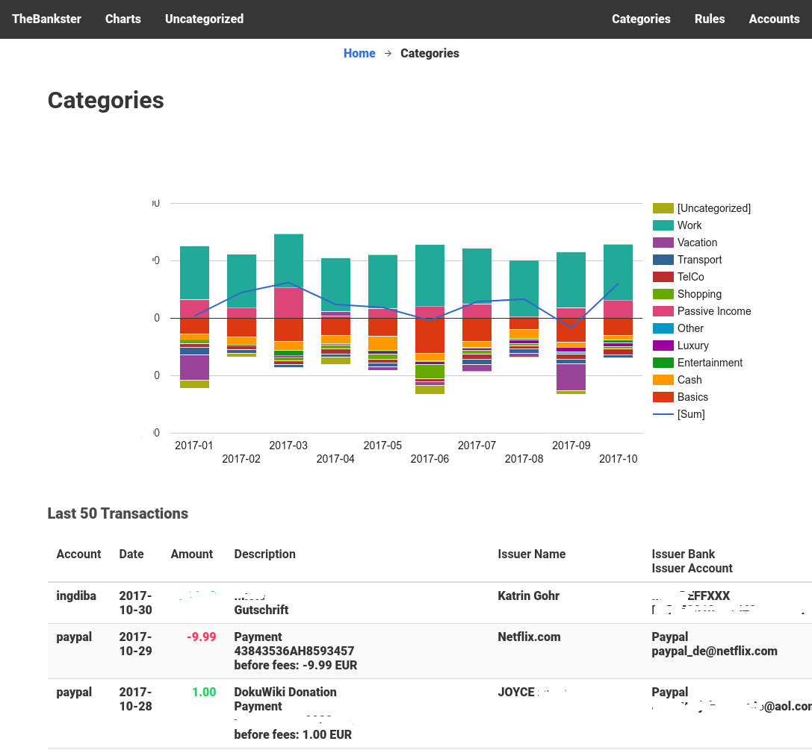

# TheBankster

TheBankster is a personal fincance monitoring tool, aimed to give you an overview over your various accounts and what you're spending your money on.

The principle is simple:

* you set up all your bank accounts
* you create categories for your income and spending habits
* you define rules how transactions should be categorized
* you gain invaluable insights (aka. pretty graphs) about yourself and your finances

## Installation and Setup

**DO NOT INSTALL THIS ON A SERVER ON THE INTERNET!** Seriously. This is meant to be used as a personal tool. There is absolutely no concept of user accounts, logins or any other safety stuff. Put this on a Raspberry at your home, but do **not** make it available from the Internet. You have been warned.

The tool requires PHP 7+ with the PDO and PDO SQLite extensions.

To install simply clone this repository and run [composer](https://getcomposer.org/) in the main directory. Point your Apache webserver to the `public` directory and you're ready to go. (If you're not using Apache you might need to fiddle with the [URL rewriting](https://www.slimframework.com/docs/start/web-servers.html), I don't know).

### Accounts

Use the webinterface to set up your bank accounts. There are currenly 4 backends supported:

**FinTS** - The HBCI/FinTS banking standard common in Germany (and Europe). Most major banks support this. Try [this site](https://www.hbci-zka.de/institute/institut_select.php) for figuring out if your bank does.

**Paypal** - You need to create an [API access user](https://www.paypal.com/de/cgi-bin/webscr?cmd=_profile-api-add-direct-access-show) at Paypal to fetch your transactions. Be sure to create a rule to skip bank statements of money moving to or from paypal to avoid double tracking.

**GoogleSheets** - This allows you to import expenses from a [Google Sheets](https://docs.google.com/spreadsheets/) spreadsheet. The sheet has to be made readable for everyone with the link. Check out [TheCashster](https://github.com/splitbrain/TheCashster) for an Android Expense tracker working with Google Sheets. 

**TargoBank** - My credit card's bank does not support FinTS so I wrote this backend to fetch the data from their online banking site. This is the most hacky backend but might give you an idea how to add your own backend. It can only download transactions of the current month.

**AmazonMail** - This is another weird one. Because Amazon has no proper API, but I buy a lot of stuff from them. This logs into an IMAP mail account and looks for order confirmation and confirmed refund emails from Amazon. This information is then used to create transactions based on your Amazon purchases. When using this, you should create a rule to skip Amazon transactions in your bank account to avoid tracking spendings twice (assign to category `-/-`).
 
 Please note: this currently only supports Amazon.de with E-Mails in German. Please also note: I do not handle things you buy with vouchers, eg. the transaction will use the full item price. See it that way: if Grandma had given you cash instead of a voucher you'd want to track what you buy for as an expense, too. But maybe manually add received vouchers as income somewhere? 

.

If you add your own backend, feel free to send a pull request.

A note about security: the credentials you provide are stored in plain text in the sqlite data base. You have to ensure you keep your installation safe and out of reach of prying eyes. Again: do not install this on a public server.

### Importing

Once your accounts are set up, it's time to import the transactions. To do so simply run the import script:

    ./bin/import.php --loglevel debug

This will start to import all transactions for the current year. Follow up calls will try to only download transactions since the last run (if your backend supports it). Don't worry, TheBankster will ignore duplicate transactions.

The above command uses the `--loglevel` argument for full verbosity. Once you're confident everything is working fine, you can use a different level.

To be useful, transactions need to be imported on a regular basis. To do so a cron job running the import once or twice a day is recommended.

### Categories

While your transactions are importing, it's time to think about categories. Categories tell you where your money goes.

Categories have two levels: a top level and the category itself. All categories with the same top level will be grouped together in the `Charts` view. Because trees in relational databases are complicated and I was really lazy, this hierarchy is implemented in the most simple, lazy way possible: You have to type the same top level for the various categories. No dropdown, no autocomplete, no nothing. Just remember the name and type it. Sorry.

Note: After setup there will be one special category name `-/-` already. This category is used to ignore certain transactions that do not influence your overall financial status. Eg. transferring money from one of your accounts to another, currency conversions on Paypal, etc.

### Rules

Once accounts are set up, categories created and transactions imported it's time to categorize the latter. You can of course manually assign a category (see below) but for all reoccuring transactions it's more sensible to define rules.

A rule tells TheBankster that when a transaction matches the rule, the associated category shall be assigned. Rules match the following things against the transaction details:

* account - only aply this rule to transactions of a single account
* spending/income - only match one of these (both is default)
* description - find the given string in the description
* issuer name - find the given string in the issuer's name   
* issuer bank - find the given string in the issuer's bank   
* issuer account - find the given string in the issuer's account   

When saving a rule TheBankster will give you a preview of matching transactions. Once you're satisfied, activate it and all matching transactions will be associated with the category.

In general you should try to make your rules as specific as possible, to avoid haveing multiple rules matching the same transaction (behaviour is undefined then - one rule will "win").

Rules will automatically be applied to every new transaction when the import runs.

## Usage

It's not rocket science, you will probably figure it out yourself. But here are a few hints.

### Charts

The Charts feature gives you bar charts on your categories as well as recent transactions for those. Important thing to know: **the charts are clickable!**

Click the legend items to dig down deeper into the category levels. When you click a bar instead, the selected month will be applied to the shown transactions. This way you can easily figure out what exactly you spent your money on in a certain month.
 
Hint: keep an eye on the sum line on the top level chart. It should stay above zero as much as possible. If it's going below zero too often, you might be living beyond your means. 
 
### Uncategorized
 
This view should help you with setting up more rules. It shows all transactions that have not category, yet. You should try to reduce this number as much as possible.
 
You can easily create a new rule from any transaction by clicking the `*` symbol. It will prefill a new rule form with the transaction details. You should shorten it down to the relevant bits before saving.
 
You can also manually assign a category to a transaction using the `↻` symbol. A little popup will ask you for the category and you can continue.
 
Note: because I'm lazy, the new manually assigned category will only show up after a page reload. Sorry. Maybe send a pull request if you think it's important.
 
### Amazon.de Support
 
Okay, so I mentioned that I buy a lot of my stuff at Amazon. So next to the weird IMAP based backend, TheBankster also automatically links Amazon order numbers to their respective order overview at Amazon.de. Watch out for the `🔍` symbol in the transaction description.
 
Yes, Amazon.de only. Because I can't really test anything else. Pull Request?
 
## Miscellaneous
 
### Currency Support
 
TheBankster assumes that all your accounts are using the same currency. That currency is set in the `config.yaml` and defaults to `EUR`.

This doesn't really matter for most of the things that TheBankster does. It only deals in amounts and does not display currencies anywhere.
 
The one exception is the Paypal backend. Paypal manages different currencies separately until you withdraw money to your account. Because we're not interested in the currency conversion transaction but the actual spending an income transactions, the Paypal backend will convert all non-main-currency transactions to an approximation in the main currency. In real life this means it converts USD to EUR.
 
This is not exact, and the exchange rate will differ from what Paypal uses. But it should be good enough for the purposes of this application.
 
If you need different currencies you need to add their exchange rates in the `CurrencyConvert` class.
 
### Other stuff
 
* I wrote this to scratch my own itch, don't expect a lot of support
* I'm happy about pull requests
* Did I mention that this is not supposed to be exposed to the Internet? Yes. Yes, I did
* TheBankster is meant for your own personal finance overview only. It might work for a couple with shared finances, too.
* TheBankster gives you information about how your income and spending is distributed. It does not tell you your actual balance on any of your accounts. That's kinda by design. It would also be really hard to do.
* Even if you don't use this, check out the cool libraries I used in the `composer.json` file, you might find a gem you didn't know. (If you're into PHP that is)
* There are a few more command line tools in the `bin` directory. I used them during development before the web interface existed. Call them with `--help` to see what they do. But the web interface is probably better now.
 
### License (MIT)
 
Copyright 2017 [Andreas Gohr](https://www.splitbrain.org)

Permission is hereby granted, free of charge, to any person obtaining a copy of this software and associated documentation files (the "Software"), to deal in the Software without restriction, including without limitation the rights to use, copy, modify, merge, publish, distribute, sublicense, and/or sell copies of the Software, and to permit persons to whom the Software is furnished to do so, subject to the following conditions:

The above copyright notice and this permission notice shall be included in all copies or substantial portions of the Software.

THE SOFTWARE IS PROVIDED "AS IS", WITHOUT WARRANTY OF ANY KIND, EXPRESS OR IMPLIED, INCLUDING BUT NOT LIMITED TO THE WARRANTIES OF MERCHANTABILITY, FITNESS FOR A PARTICULAR PURPOSE AND NONINFRINGEMENT. IN NO EVENT SHALL THE AUTHORS OR COPYRIGHT HOLDERS BE LIABLE FOR ANY CLAIM, DAMAGES OR OTHER LIABILITY, WHETHER IN AN ACTION OF CONTRACT, TORT OR OTHERWISE, ARISING FROM, OUT OF OR IN CONNECTION WITH THE SOFTWARE OR THE USE OR OTHER DEALINGS IN THE SOFTWARE. 